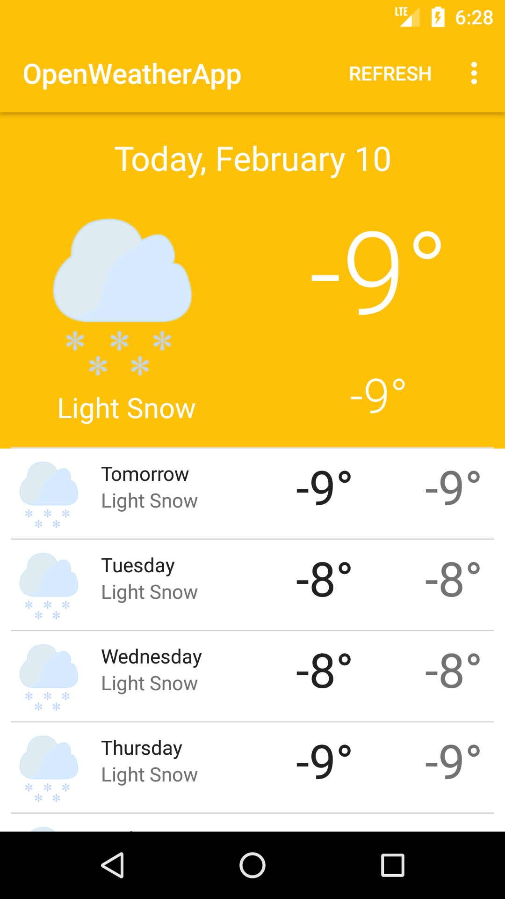

# OpenWeatherApp
A weather app for android. Obtains and locally stores weather data using the OpenWeatherMap API in a local database using the Room persistence library. Utilizes responsive design and RecyclerView for displaying weather efficiently, a job scheduler to periodically and asynchronously load new weather data and has various customizable user preferences. Currently supports English and French.

